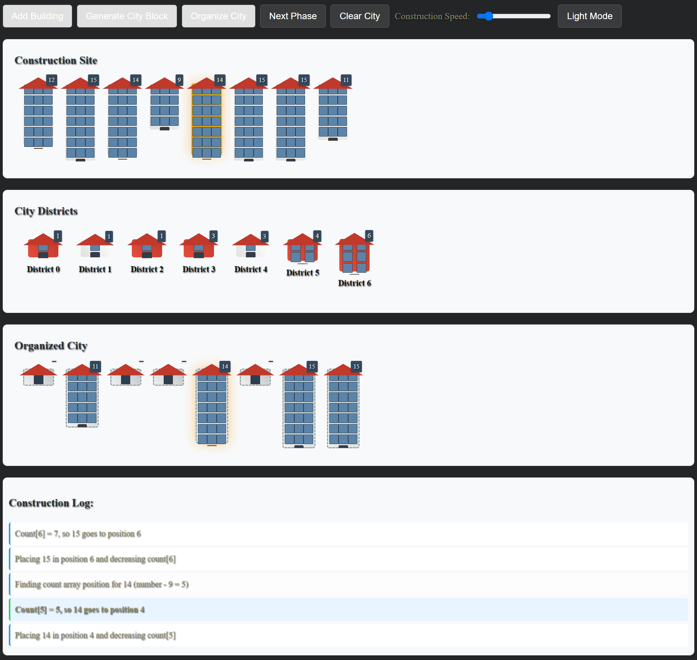

# Counting Sort Visualization



## Kort Beskrivelse

Counting Sort Visualization er et interaktivt webværktøj, der hjælper dig med at forstå, hvordan Counting Sort algoritmen fungerer. Med trin-for-trin animationer og klare visualiseringer gør dette værktøj det nemt at lære og udforske sorteringsprocessen.

## Se Den Deployede Udgave

[🔗 Åbn Counting Sort Visualization](https://zenkhalil.github.io/Exams-project-DOA/)

## Anvendte Algoritmer og Datastrukturer

### Algoritme
- **Counting Sort**: En effektiv sorteringsalgoritme, der fungerer ved at tælle forekomsterne af hvert element i input-arrayet og bruge disse tællinger til at placere elementerne i det sorterede array.

### Datastrukturer
- **Cirkulær Buffer**: Anvendes til at spore og håndtere sorteringstrin på en hukommelseseffektiv måde. 
Dette gør det muligt at gemme et fast antal trin og overskrive de ældste, når bufferen er fuld.
- **Arrays**: Bruges til at holde styr på originalt input, tælle forekomster, og det endelige sorterede resultat.

## Kør Visualiseringen Lokalt

### Installation

1. **Clone Repository:**
   ```bash
   git clone https://github.com/ZenKhalil/Exams-project-DOA.git
   ```

2. **Naviger til Projektmappen:**
   ```bash
   cd Exams-project-DOA
   ```

3. **Åbn `index.html`:**
   - Dobbeltklik på `index.html` for at åbne det i din browser.
   - Eller servér det via en lokal server for bedre funktionalitet (f.eks. ved at trykke på port navn nederst af VS Code).

### Brug

1. **Tilføj Tal:**
   - Klik "Add Number" for at tilføje individuelle tilfældige tal.
   - Klik "Generate Random Numbers" for at skabe et nyt tilfældigt array.

2. **Start Sortering:**
   - Klik "Start Sorting" for at begynde visualiseringen.
   - Brug "Next Step" til at avancere gennem algoritmen.
   - Juster hastighedsslideren for at kontrollere animationshastigheden.

3. **Naviger Gennem Trin:**
   - Se den aktuelle trinbeskrivelse i historik sektionen.
   - Klik på tidligere trin for at springe tilbage.
   - Brug "Reset" for at starte forfra.

